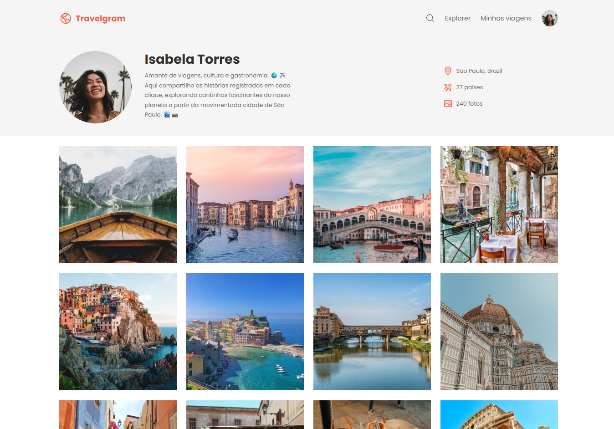

# 🌍 Projeto: Travelgram - Perfil de Viagens

## 📖 Sobre o Projeto
Este projeto foi desenvolvido como um exercício prático para consolidar conhecimentos fundamentais de **Web Design Responsivo** e **Semântica HTML**. A página simula uma rede social de viagens, onde o desafio principal foi trabalhar a harmonia entre tipografia, fotos e espaçamentos para criar uma interface moderna e organizada.

---

## 📸 Preview do Projeto

  

---

## 🚀 Tecnologias Utilizadas
* **HTML5**: Estruturação de conteúdo com seções (`nav`, `header`, `main`, `footer`).
* **CSS3**: 
  * Uso de variáveis CSS (`:root`) para cores e fontes.
  * Organização modular com `@import` para facilitar a manutenção.
  * Layout flexível com **Flexbox** para alinhamento de itens e galeria.
  * Reset de `box-sizing`, margens e paddings.
* **Google Fonts**: Utilização da fonte *Poppins* para um visual limpo e profissional.

---

## 📋 Funcionalidades
* **Perfil de Usuário**: Cabeçalho com foto arredondada e biografia personalizada.
* **Status Card**: Seção lateral com informações de localização, número de países e fotos.
* **Galeria de Fotos**: Exibição de imagens em grid com efeito de preenchimento inteligente.
* **Menu de Navegação**: Links de acesso rápido e ícone de busca integrados ao layout.

---

## 🎨 Design

A página utiliza uma paleta de cores moderna e tons claros para destacar as fotos de viagem:
* **Background:** Fundo suave na cor `#F5F5F5` para separar o perfil da galeria.
* **Destaques:** Uso da cor coral `#EF5F4C` para ícones e interações.
* **Imagens:** Bordas arredondadas e preenchimento `cover` para harmonia visual.

---

## 📝 Como usar
1. Clone este repositório.
2. Abra o arquivo `index.html` no seu navegador.